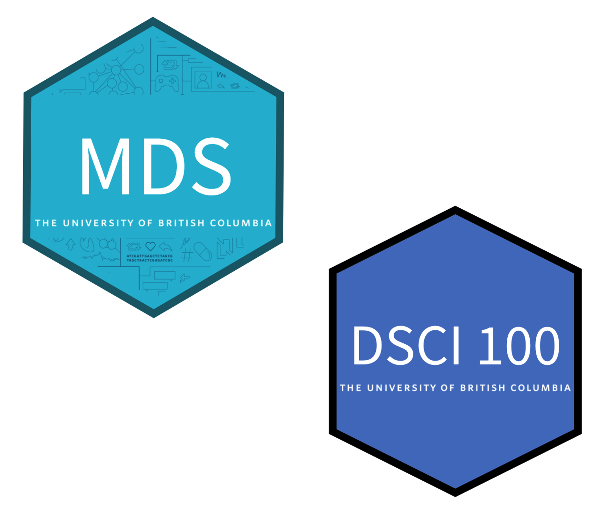

```{r setup, include=FALSE}
options(htmltools.dir.version = FALSE)
```

```{r xaringan-themer, include=FALSE, warning=FALSE}
library(xaringanthemer)
style_duo_accent(
  primary_color = "#9F999C",
  secondary_color = "#FFE5F3",
  inverse_header_color = "#8F8C8E",
  link_color = "deeppink",
  title_slide_text_color = "white",
  header_font_google = google_font("Josefin Sans"),
  text_font_google   = google_font("Montserrat", "300", "300i"),
  code_font_google   = google_font("Fira Mono")
)
```

class: center, middle

# A bit about me and what I teach at UBC


---

class:

- Software & Data Carpentry Instructor
- Rstudio {tidyverse} Instructor
- Assistant Professor of Teaching, Dept. of Statistics, UBC
- Co-Director of the UBC Master of Data Science program, UBC

.pull-left[

]

.pull-right[
#### Graduate courses:
- [DSCI 523: Programming for data manipulation](https://github.com/UBC-MDS/DSCI_523_r-prog)
- [DSCI 552: Statistical inference and computation I](https://github.com/UBC-MDS/DSCI_552_stat-inf-1)
- [DSCI 522: Data science workflows](https://github.com/UBC-MDS/DSCI_522_dsci-workflows)
- [DSCI 524: Collaborative software development](https://github.com/UBC-MDS/DSCI_524_collab-sw-dev)

#### Underaduate courses:
- [DSCI 100: Introduction to data science](https://ubc-dsci.github.io/dsci-100/README.html)
- DSCI 310: Reproducible and trustworthy workflows for data science (new course!)
]
---

class: inverse, center, middle

# Data Science:

### *the study and development of reproducible and auditable processes to obtain insight from data*

---

## Reproducible analysis:

#### *reaching the same result given the same input, computational methods and conditions*.fn[1]

## Transparent analysis,

#### *a readable record of the steps used to carry out the analysis as well as a record of how the analysis methods evolved*.fn[2]

.footnote[
[1] National Academies of Sciences, 2019

[2] Parker, 2017 and Ram, 2013
]

---

## Why do we adopt this definition?

We believe that data science work should both bring insight 
and employ reproducible and auditable methods so that
trustworthy results and data products can be created.

Data products can be built via other methods, 
but we lack confidence in how the results or
products were created.

We believe this stems from non-reproducible and
non-auditable analyses:

1. lacking evidence that the results or product could be regenerated given
the same input computational methods, and conditions

2. lacking evidence of the steps taken during creation

3. having an incomplete record of how and why analysis decisions were
made

---

class: inverse, center, middle

## *So if reproducibility is so important for data science, why is it hard to teach it?*

---

class: middle

## Possibilities:

1. Lack of awareness of the problem?

2. Reproducibility is an inconvenient means to end, rather than an important skill?

3. Reproducibility does not directly lead to novel insights?

---

## Key things for teaching reproducibility

--

### 1. placing extra emphasis on motivation

--

### 2. guided instruction

--

### 3. lots of practice!!!

---

class: inverse, center, middle

# Why do we need "extra" motivation?

---
class: center


*Source: https://xkcd.com/1597/*
---

class: center


*Source: https://twitter.com/overflow_meme/status/1232185254280138753*

---
class: center


*Source: https://www.meme-arsenal.com/en/create/meme/1759571*

---

## Examples of how we motivate learning

--

### 1. Tell stories from the trenches

--

### 2. Study cases of failures with real world consequences

--

### 3. Let them fail (in a controlled manner)


---

### 1. Tell stories from the trenches

--

*As a Masters student, I started to use R to do my statistical analysis.
I obtained the results I needed from running my code in the R console 
and copying the results into the word document that was my manuscript.
Six months later we were working on revisions requested by the reviewers 
and I could not remember which version of the code I ran to get my results.
I eventually figured it out through much trial and error, 
but the process was inefficient and very stressful.*

--

*As a Masters student, I spent many hours customizing the colors of a figure
that had many points and lines on it using Adobe Illustrator. 
The next week in a meeting with my supervisor, 
she very correctly pointed out that the color scheme I chose 
would be problematic for color-blind people.
I then had to spend many more hours repeating the same work 
to change the colors of all the lines and points to fix it.
It was very frustrating to repeat such tedious and time consuming work,
and I was not able to meet other deadlines on time because I had to redo this.*

---

### 2. Study cases of failures with real world consequences

| Reproducibility error                                    | Consequence                                          | Source(s)                                |
|----------------------------------------------------------|------------------------------------------------------|------------------------------------------|
| Limitations in Excel data formats                        | Loss of 16,000 COVID case records in the UK          | Kelion, 2020                    |
| Automatic formatting in Excel                            | Important genes disregarded in scientific studies    | Zeeberg et al., 2004; Ziemann et al., 2016 |
| Deletion of a cell caused rows to shift                  | Mix-up of which patient group received the treatment | Wallensteen et al., 2018             |
| Using binary instead of explanatory labels               | Mix-up of the intervention with the control group    | Aboumatar et al., 2019             |
| Using the same notation for missing data and zero values | Paper retraction                                     | Whitehouse et al., 2021               |
| Incorrectly copying data in a spreadsheet                | Delay in the opening of a hospital                   | Picken, 2020                    |


---

### Example: Let them fail (in a controlled manner)

**Course:** DSCI 522 (workflows for data science)

.pull-left[
**Topic:** Containerization via Docker
]

<center>

</center>

Give students a data analysis pipeline project on GitHub, and ask them to run it.
They have done things like this before, but this time, we add several packages 
that they haven't used before. Let them work to install the packages and get the
analysis up and running.

Give them a second data analysis pipeline project on GitHub, and ask them to run it.
This also has several packages they haven't used before, but this time there are 
instructions for running it in a Docker container. 

---

class: inverse, center, middle

# Why guided instruction?

---

class: center, middle

### *From our experience, reproducibility is not something that most people or students figure out on their own, or if they do, it is not an efficient process...*

---

class: middle

### Excerpt from Roger Peng's blog post on <br> ["The Role of Theory in Data Analysis"](https://simplystatistics.org/2018/12/11/the-role-of-theory-in-data-analysis/):

#### *There is no need for a new data analyst to learn about reproducibility “from experience”. We don’t need to lead a junior data analyst down a months-long winding path of non-reproducible analyses until they are finally bitten by non-reproducibility (and therefore “learn their lesson”). We can just tell them*

#### *"In the past, we’ve found it useful to make our data analyses reproducible. Here’s a workflow to guide you in your own analyses."*

#### *With that one statement, we can “compress” over 20 years of experience.*

---

## Examples of how we use guided instruction

--

### 1. Live demonstration

--

### 2. Pre-lecture activities

--

### 3. Worksheets

---

class: inverse, center, middle


### However, there be dragons...

---

class: center, middle


### *...fast moving field means constant curation*

*Source: https://github.com/ 
<br>& http://www.piwai.info/blog-meets-monster-octocat*

---

### Example: guided instruction

**Course:** DSCI 100 (Introduction to data science)

.pull-left[
**Topic:** Version control
]


Live demonstrate how to use the GitHub website to create a repository, and a Git 
GUI to clone the repository as well as push code to the repository on GitHub.

Students then work through a worksheet, that guides them to do the same thing,
which asks them questions along the way about what they are doing at each stage
to reinforce the conceptual aspects of what they are doing.

**Artifacts for this example:**
- [Accompanying textbook reading](https://ubc-dsci.github.io/introduction-to-datascience/Getting-started-with-version-control.html)
- [Live demonstration](https://youtu.be/attPo4zEElU)
- [Worksheet to guide students](https://github.com/UBC-DSCI/dsci-100-assets/blob/master/2021-spring/materials/worksheet_05/worksheet_05.ipynb)

---
class: inverse, center, middle

# Why lots of practice?

---

class: middle

## **Mastery of a subject often involves consolidating ideas, concepts and theories into long-term memory.** 

## **And consolidating most things into long-term memory requires repetition (Ebbinghaus 1913).**

---

class: center, middle

### However, when we teach reproducibility workflows and skills, we want students to do more than learn them, we want them to use and practice them. 

### We want to actually change their habits or behaviours.

---

class: center, middle

### An aside: A book that has recently made me think more about how we can tangibly do this:
<a href="https://jamesclear.com/atomic-habits">

</a>

---

## Examples of how we embed lots of practice

--

### 1. Student practice following live demos

--

### 2. Lots of low stakes assessments with small/short problems

--

### 3. Learning technologies & platforms use authentic data science reproducibility tools

---

### Example: lots of practice!!!

**Course:** Almost all Master of Data Science courses (~ 20 courses)

.pull-left[
**Topic:** Version control
]


We use GitHub as our course management system. Homework instructions and 
assignments are distributed to students as GitHub repositories. They have 
to submit their assignment by pushing their work to the GitHub repositories.

We also require that they have 3 commits associated with each homework 
submission.

By the end of the program, they have version controlled their work in > 80 
different repositories!!!

**Tools for using GitHub as a learning management system:**
- [GitHub Classroom](https://classroom.github.com/)
- [Classy](https://github.com/ubccpsc/classy)
- [rhomboid](https://github.com/mgelbart/rhomboid)
---


class: inverse, center, middle

# Wrap up

---

class: middle

## Key things for teaching reproducibility

### 1. Extra emphasis on motivation

### 2. Guided instruction

### 3. Lots of practice!!!

---

## References

National Academies of Sciences, Engineering, and Medicine and others
(2019). Reproducibility and replicability in science. National Academies
Press.

Parker, Hilary (2017). “Opinionated analysis development”. In: PeerJ
Preprints 5, e3210v1.

Ram, Karthik (2013). “Git can facilitate greater reproducibility and increased
transparency in science”. In: Source code for biology and medicine 8.1,
pp. 1–8.

---

class: inverse, center, middle

# Questions?


### @TiffanyTimbers

####*bit.ly/2O2yULa*